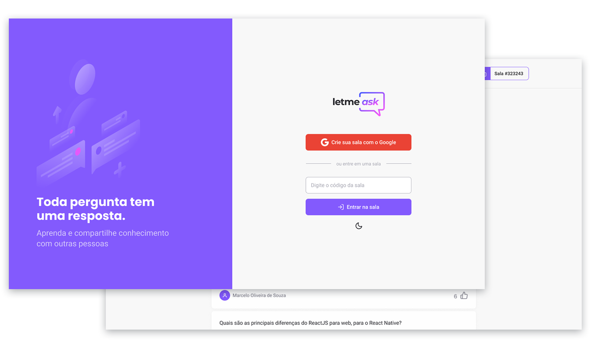

<p align="center">
  
</p>

<p align="center">
     
</p>

<h1 align="center">
  
</h1>

## Projeto

Criador de salas Q&A de maneira bem simplificada. Ótimo para usar em lives em que o host deseja responder as dúvidas do seu público.

## Tecnologias

Esse projeto teve como principais tecnologias:

- [TypeScript](https://www.typescriptlang.org/)
- [React](https://reactjs.org)
- [Firebase](https://firebase.google.com/)

Mas também utiliza:
- [React Hot Toasts](https://react-hot-toast.com/)
- [React Device Detect](https://github.com/duskload/react-device-detect)
- [Classnames](https://github.com/JedWatson/classnames)

## Como executar

Antes de qualquer coisa crie uma conta no [Firebase](https://firebase.google.com/) e tenha certeza de configurar os serviços de autenticação via Google e Realtime Database.


Clone o repositório e acesse a pasta:

```bash
$ git clone https://github.com/iranadryan/letmeask-nlw
$ cd letmeask-nlw
```

Crie um documento .env com as seguintes chaves encontradas no firebase:

```dosini
REACT_APP_API_KEY=
REACT_APP_AUTH_DOMAIN=
REACT_APP_DATABASE_URL=
REACT_APP_PROJECT_ID=
REACT_APP_STORAGE_BUCKET=
REACT_APP_MESSAGING_SENDER_ID=
REACT_APP_APP_ID=
```

Para iniciar a aplicação basta:

```bash
# Instalar as dependências
$ yarn || npm

# Iniciar o projeto
$ yarn start || npm run start
```

## License

Esse projeto está sob a licença MIT. Veja o arquivo [LICENSE](LICENSE.md) para mais detalhes.